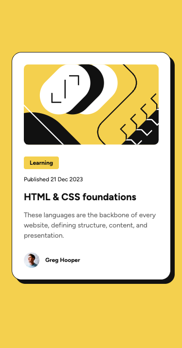

# Frontend Mentor - Blog preview card

## English | 日本語

---

### 📋 Overview | 概要

**EN**  
This is a solution to the [Frontend Mentor - Blog Preview Card Challenge](https://www.frontendmentor.io/challenges/blog-preview-card-ckPaj01IcS).  
The goal was to implement the design using HTML and CSS Grid layout.

**JP**  
これは [Frontend Mentor](https://www.frontendmentor.io/challenges/blog-preview-card-ckPaj01IcS) の「Blog preview card」課題の模写です。  
HTML/CSSをGridレイアウトで実装することを目的として取り組みました。

---

### 📸 Screenshot | スクリーンショット

---

### 🔗 Live Demo | デモリンク（GitHub Pages）

**EN**  
▶ [View the live page](https://codebyshoma.github.io/Blog-preview-card/)

**JP**  
▶ [公開されたページを見る](https://codebyshoma.github.io/Blog-preview-card/)

---

### 🛠 Built with | 使用技術

- HTML5  
- CSS3 (Custom Properties, CSS Grid, `clamp()` for responsive font size)

---

### 🧪 My Process | 作業プロセス

**EN**
1. Set up folder structure and initialize files  
2. Apply grid to `main` for layout centering  
3. Use `.wrapper` for full-width background and content width control  
4. Place elements using `.inner` with named grid-template  
5. Manage styles using CSS custom properties  
6. Used `clamp()` to implement fluid, responsive font sizes  
7. Deploy via GitHub Pages

**JP**
1. フォルダ構成とファイル初期化  
2. `main` に grid を設定して中央寄せレイアウト  
3. `.wrapper` に全幅背景・コンテンツ幅調整  
4. `.inner` に各要素を配置（grid-template に名前をつけて整理）  
5. カスタムプロパティで色・サイズ・ウエイトなどを統一管理  
6. `clamp()` を使ってフォントサイズをレスポンシブに対応  
7. GitHub Pages で公開

---

### 🧠 What I Learned | 学んだこと

**EN**
- Layout design using Style Guide  
- CSS Grid for structural layout  
- Maintainability through CSS custom properties  
- Clear separation of `.wrapper` and `.inner` responsibilities  
- How to use `clamp()` to make font sizes responsive

**JP**
- Style Guide をもとにした設計  
- Grid を活用したレイアウト設計  
- カスタムプロパティで管理することで保守性が上がること 
- `.wrapper` `.inner` の役割の明確な使い分け 
- `clamp()` を活用したフォントサイズのレスポンシブ対応

---

### ✨ Extra | アレンジ

**EN**
- Added hover animation to title

**JP**
- hoverアニメーションの追加

---

### 🔧 Improvements | 今後の改善点

**EN**
- Improve reusability with component-oriented design

**JP**
- コンポーネント設計を意識した再利用性向上

---

### 📚 Resources | 参考リソース

- [Frontend Mentor Challenge Page](https://www.frontendmentor.io/challenges/blog-preview-card-ckPaj01IcS)  
- [Google Fonts - Figtree](https://fonts.google.com/specimen/Figtree)  
- [CSS Grid Guide - MDN](https://developer.mozilla.org/ja/docs/Web/CSS/CSS_grid_layout)  
- [CSS `clamp()` - MDN](https://developer.mozilla.org/en-US/docs/Web/CSS/clamp)  
- [CSS Custom Properties Guide - MDN](https://developer.mozilla.org/ja/docs/Web/CSS/Using_CSS_custom_properties)

---

### 🧑‍💻 Author | 著者

- GitHub: [@CodeByShoma](https://github.com/CodeByShoma)  
- Frontend Mentor: [@CodeByShoma](https://www.frontendmentor.io/profile/CodeByShoma)

---

### 🙏 Acknowledgments | 謝辞

**EN**  
Thanks to Frontend Mentor for providing this helpful challenge!
Through this project, I learned how to code with maintainability in mind by using CSS Grid and custom properties.

**JP**  
この課題を通じて、CSS Grid とカスタムプロパティを使って、保守性を考慮したコーディングを学ぶ事ができた。  
わかりやすい課題を提供してくださった Frontend Mentor に感謝します！

---
